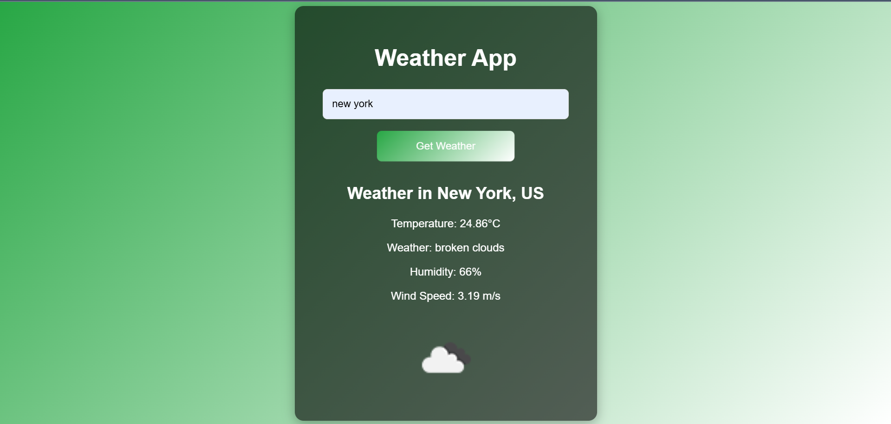

# 🌦️ Weather App

A simple and elegant Weather App built using **HTML**, **CSS**, and **JavaScript**. It fetches real-time weather data using the **OpenWeatherMap API**. Users can enter the name of any city and instantly get its current weather conditions like temperature, humidity, wind speed, and weather description along with an icon.

---

## ✨ Features

- 🔍 **Search weather by city name**
- 🌐 **Real-time weather data** from OpenWeatherMap API
- 🌡️ Displays **temperature, humidity, wind speed, and weather description**
- 🎨 **Responsive and animated UI** for a better user experience
- ⚠️ Handles invalid or empty inputs gracefully

---

## 📸 Screenshot  

  

---

## 🚀 Technologies Used

- **HTML5** – Markup structure
- **CSS3** – Styling and animations
- **JavaScript (ES6)** – Logic and API integration
- **OpenWeatherMap API** – For fetching real-time weather data

